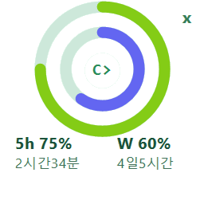
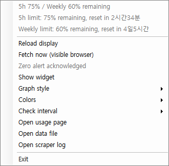
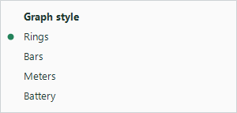

# Codex Usage Monitor

[한국어 README](README.md)

## Recommended Choice

- **For the lightest and easiest version to try first, use the [v2.0.0-preview.6 WebView2 Native Preview](https://github.com/saveway/codex-usage-monitor/releases/tag/v2.0.0-preview.6).** It is approximately 0.3 MB, bundles no Python, Playwright, or Chromium, and uses Microsoft Edge WebView2 Runtime. It is still a preview, so use v1 Stable if you encounter problems.
- **For the established stable approach, or if v2 does not work, use [v1.0.1 Stable](https://github.com/saveway/codex-usage-monitor/releases/tag/v1.0.1).** v1 Full is large because it includes Chromium but requires no Python installation. v1 Lite is small but requires Python and Playwright.

V2 does not yet replace v1 as the default stable distribution. See the [WebView2 native preview documentation](native-webview2/README-native.md) for execution, security, and limitation details.

V2 Preview is a portable ZIP, not an installer. It includes Rings, Bars, Meters, and Battery widget graphs plus reset/credits display, but it still does not include an installer, startup registration, or code signing. Do not run it directly inside the archive or from a temporary directory. Extract the entire ZIP to a permanent directory of your choice, then run `CodexUsageMonitorV2.exe`. Running from a temporary location can break relaunching, path persistence, or a future startup configuration.

Release tag ownership is separated: the v1 Full/Lite workflow responds only to `v1.*`, while the v2 preview workflow responds only to `v2.*-preview.*`. Both workflows retain manual dispatch support.

An unofficial personal tool that displays values from the ChatGPT Codex usage page in the Windows 10/11 system tray and a desktop widget.

> This project is not an official app developed, endorsed, supported, or distributed by OpenAI. OpenAI, ChatGPT, and Codex are trademarks of their respective owners.

## Important Notice

OpenAI does not currently provide a documented public API for these Codex usage values. This program reads the rendered webpage with Playwright, so it may stop working when the site structure changes and may be restricted by applicable terms or policies.

Before using or redistributing it, you are responsible for reviewing and complying with OpenAI's current terms, policies, rate limits, and account rules. The default and minimum automatic check interval is 10 minutes.

The program contains no automation-detection bypass flags, off-screen browser placement, or browser-window concealment logic. A browser is shown only for the first login or a login explicitly requested by the user. Routine collection uses Playwright's standard headless mode. If the page does not render correctly in headless mode, collection fails instead of secretly substituting a visible browser.

## Privacy and Security

Please understand the following before using the program.

- This program **does not use a developer-operated server or relay server.**
- It contains **no telemetry or usage-statistics reporting.**
- It does not read, store, or transmit your ChatGPT password.
- You sign in **directly on the ChatGPT/OpenAI browser page.**
- Authentication cookies and browser session data may be stored in the local `browser-profile/` to preserve your login session.
- Usage JSON, settings, and logs are stored locally only in `%LOCALAPPDATA%\CodexUsageMonitor`.
- For complete removal, exit the app and delete `%LOCALAPPDATA%\CodexUsageMonitor`.

The `browser-profile/` may contain a live login session. Never upload or share this directory through GitHub, messaging, bug reports, or any other channel.

## Screenshots

These public screenshots use example values and contain no real account data.

### Rings Widget



### Tray and Widget Context Menu



### Graph Style Selection



## Requirements

- Windows 10 or Windows 11
- Python 3.11 or newer available on `PATH`
- Windows PowerShell 5.1
- Playwright Chromium

## Run the Windows Package from GitHub Releases

Download either the Full or Lite package and its matching SHA256 file from the [v1.0.1 Stable Release](https://github.com/saveway/codex-usage-monitor/releases/tag/v1.0.1). For the smaller v2 preview, see [Recommended Choice](#recommended-choice) above.

```text
CodexUsageMonitor-windows-full.zip
CodexUsageMonitor-windows-full.zip.sha256
CodexUsageMonitor-windows-lite.zip
CodexUsageMonitor-windows-lite.zip.sha256
```

1. Save both files in the same directory.
2. Verify the ZIP's SHA256 in PowerShell:

   ```powershell
   Get-FileHash .\CodexUsageMonitor-windows-full.zip -Algorithm SHA256
   Get-Content .\CodexUsageMonitor-windows-full.zip.sha256
   ```

   If you selected Lite, replace `full` with `lite` in both commands.

3. Confirm that the hashes match, then extract the ZIP to a directory of your choice.
4. Run `run-codex-usage-tray.bat` from the extracted directory.

In the Full package, `codex-usage-scraper.exe` is not the main user-facing launcher; it is the background collector called by the BAT/PowerShell tray app. For both Full and Lite packages, start the app with `run-codex-usage-tray.bat`.

The Full Windows package includes a PyInstaller-built scraper executable and the Playwright Chromium used for both visible login and headless automatic collection. Its download and extracted sizes can therefore be hundreds of megabytes, but it runs without a separate Python or Playwright installation.

The Lite Windows package contains no Chromium browser or executable. It contains only the public source, scripts, documentation, and example JSON files. It is much smaller, but you must install Python 3.11 or newer and run these commands in the extracted directory:

```powershell
pip install -r requirements.txt
python -m playwright install chromium
```

After installation, run `run-codex-usage-tray.bat`. Lite stores login sessions and usage data in `%LOCALAPPDATA%\CodexUsageMonitor`, just like Full.

When you download a GitHub Actions artifact, the outer ZIP named `CodexUsageMonitor-windows-full` or `CodexUsageMonitor-windows-lite` contains the actual distribution ZIP and its matching SHA256 file. Extract the outer ZIP first, then verify the SHA256 of the inner distribution ZIP. GitHub Releases provide all four files directly.

The distributed executable is not code-signed, so Windows SmartScreen may display a warning. If you do not trust the packaged executable, do not bypass the warning; use the source instructions below and run the project directly from source.

The ZIP distribution stores and transmits the same data as the source version. It uses no developer-operated server or telemetry. Login session data, usage, settings, and logs are stored locally in `%LOCALAPPDATA%\CodexUsageMonitor`. After exiting the app, delete this directory to remove local data created by the distribution.

Manually dispatched Actions builds provide separate `CodexUsageMonitor-windows-full` and `CodexUsageMonitor-windows-lite` artifacts. Builds triggered by a `v1.*` tag automatically attach both ZIPs and their SHA256 files to a GitHub Release.

TODO: On Windows systems with Microsoft Edge installed, Playwright `channel="msedge"` could support a simpler Edge-based package without bundling Chromium. This requires thorough validation of the installed Edge/Playwright version combination, visible and headless operation, and persistent profile behavior before it can become a separate distribution option.

## Run from Source

Run the following commands in the project directory:

```powershell
pip install -r requirements.txt
python -m playwright install chromium
```

Launcher:

```text
run-codex-usage-tray.bat
```

### Start Automatically with Windows

```powershell
powershell -ExecutionPolicy Bypass -File .\install-startup.ps1
```

To remove only the automatic startup entry:

```powershell
powershell -ExecutionPolicy Bypass -File .\uninstall-startup.ps1
```

## How to Use

### 1. First Run and Login

1. Double-click `run-codex-usage-tray.bat`.
2. If there is no saved login session, a browser opens for ChatGPT login. This browser does not collect your password; it lets you sign in directly on the OpenAI page and create a local session.
3. Complete the ChatGPT login in the browser. Once the usage page is read, the browser closes and the result is written to the local data file.
4. Hover over or right-click the Codex icon in the Windows notification area to see the result.

Do not run `codex-usage-scraper.exe` directly in the Full package. It is the background collector called by the BAT/PowerShell tray app. Both Full and Lite packages are started with `run-codex-usage-tray.bat`.

The login session may be retained in `%LOCALAPPDATA%\CodexUsageMonitor\browser-profile`, so you normally do not need to sign in on every run. If the session expires or OpenAI requires reauthentication, sign in again through the visible browser.

### 2. Displayed Values

The tray tooltip and widget display the following values when available:

- Remaining percentage of the five-hour limit and time until reset
- Remaining percentage of the weekly limit and time until reset
- Remaining credits when the credit value is not zero
- Current collection status and the latest saved data

Double-click the tray icon to open the widget and hide the tray icon. Closing the widget restores the tray icon. You can drag the widget to move it. Double-click the center Codex logo to switch between 128×128 and 256×256 sizes.

### 3. Context Menu

Right-clicking either the tray icon or the widget opens the same menu.

- `Reload display`: Reads the existing local data again and refreshes only the display. It does not fetch the webpage.
- `Fetch now (visible browser)`: Opens a visible browser and immediately fetches current usage.
- `Acknowledge zero alert`: Acknowledges and stops the flashing 0% alert.
- `Show widget`: Shows the widget from tray mode.
- `Graph style`: Selects Rings, Bars, Meters, or Battery.
- `Colors`: Changes five-hour, weekly, and interface colors or restores their defaults.
- `Check interval`: Changes automatic collection to 10, 15, 30, or 60 minutes.
- `Open usage page`: Opens the original ChatGPT Codex usage page.
- `Open data file`: Opens the current local usage JSON in Notepad.
- `Open scraper log`: Opens the collector log in Notepad.
- `Exit`: Exits the program.

### 4. When to Fetch Manually

Use `Fetch now (visible browser)` in these situations:

1. The program has started but no data exists yet.
2. The login session has expired and you need to sign in again.
3. Automatic headless collection repeatedly fails.
4. You want an immediate value instead of waiting for the next scheduled check.

Complete any required login or authentication directly in the visible browser. If collection fails, a notification displays the process exit code and collector log path. A warning dialog is also shown when the widget is open.

### 5. Status Messages

- `No data yet`: No usage data has been successfully saved yet.
- `Login or Fetch now required`: A login or manual collection through the visible browser is required.
- `error`: The latest collection failed. Possible causes include network failure, an expired login, a page-structure change, or headless rendering behavior. Check `Open scraper log`, then run `Fetch now (visible browser)`.

### 6. Change the Automatic Interval

Right-click the tray icon or widget, open `Check interval`, and select 10, 15, 30, or 60 minutes. The choice is saved immediately and the background collector restarts with the new interval. Intervals below 10 minutes are not offered to avoid unnecessary requests to the site and account.

### 7. Check Logs

Use `Open scraper log` in the context menu for webpage collection and login-related errors. Tray startup and UI errors are written to:

```text
%LOCALAPPDATA%\CodexUsageMonitor\codex-usage-scraper.log
%LOCALAPPDATA%\CodexUsageMonitor\codex-usage-tray.log
```

If the tray icon does not appear after launch, run `debug-codex-usage-tray.bat` to inspect the error. Logs can include page status or local paths, so review them before sharing.

### 8. Complete Removal

1. Select `Exit` from the tray or widget context menu.
2. If automatic startup was installed, run `uninstall-startup.ps1`.
3. Delete the program source directory.
4. To remove the saved login session, usage, settings, and logs, delete `%LOCALAPPDATA%\CodexUsageMonitor`.

Deleting the final directory also removes authentication cookies from the local `browser-profile`.

## Local Data

All mutable data is stored outside the source repository at:

```text
%LOCALAPPDATA%\CodexUsageMonitor
```

Main contents:

- `browser-profile/`: authentication cookies and browser session state
- `codex-usage.json`: current usage and credit values
- `codex-usage-settings.json`: display colors, graph, and interval settings
- `codex-usage-ack.json`: acknowledged alert state
- `*.log`, `*.lock`, and `*.pid`: operational and process-management files

Treat the entire directory as private data.

The `%LOCALAPPDATA%\CodexUsageMonitor` directory can grow because `browser-profile/` retains browser data for the login session. The program removes nonessential browser caches at startup and after collection and limits log sizes, but some browser data may remain after long-term use.

For a complete reset, select `Exit` from the tray or widget menu and then delete the entire `%LOCALAPPDATA%\CodexUsageMonitor` directory. This removes usage data, settings, logs, and the saved login session, so you must sign in to ChatGPT again on the next run.

## Debug Capture

Full-page text capture is disabled by default. Enable it explicitly only when local debugging is necessary:

```powershell
$env:CODEX_USAGE_DEBUG_CAPTURE = '1'
```

Saved text has numeric values removed and email/account-related lines redacted, but sensitive page labels may remain. Review it manually before sharing and remove the environment variable when debugging is complete.

## Files That Must Never Be Published

Do not commit or distribute these files and directories:

```text
CodexUsageMonitor/
browser-profile/
codex-usage-browser-profile/
codex-usage.json
codex-usage-settings.json
codex-usage-ack.json
codex-usage-page-text.txt
codex-usage-scraper.log
codex-usage-tray.log
*.log
*.lock
*.pid
.env
```

Only `*.example.json` files are intended as public examples.

## Development and Security Checks

Inspect the current file tree before publishing. `rg` (ripgrep) is a separate tool and is not included with Windows or PowerShell. Install it before using the first command, for example with `winget install BurntSushi.ripgrep.MSVC`.

```powershell
rg -n -i "api[_-]?key|access[_-]?token|refresh[_-]?token|authorization|bearer|cookie|session" .
Get-ChildItem -Force -Recurse | Where-Object { $_.FullName -match 'browser-profile|CodexUsageMonitor|\.log$|page-text' }
```

Without `rg`, use PowerShell's built-in `Select-String`:

```powershell
Get-ChildItem -Force -Recurse -File | Select-String -Pattern 'api[_-]?key|access[_-]?token|refresh[_-]?token|authorization|bearer|cookie|session' -CaseSensitive:$false
```

After creating a Git repository, inspect every revision before pushing:

```powershell
git log --all --oneline
git rev-list --objects --all
git log -p --all -G "api[_-]?key|access[_-]?token|refresh[_-]?token|authorization|bearer|cookie|session"
```

Using a dedicated scanner such as Gitleaks or TruffleHog before publication is recommended.

## Limitations

- The parser depends on the current ChatGPT page structure and language labels.
- Headless browser rendering can fail depending on site behavior.
- An expired login session requires the user to sign in again.
- This project does not provide an official usage API or guarantee continued compatibility.

## License

MIT License. See [LICENSE](LICENSE).
